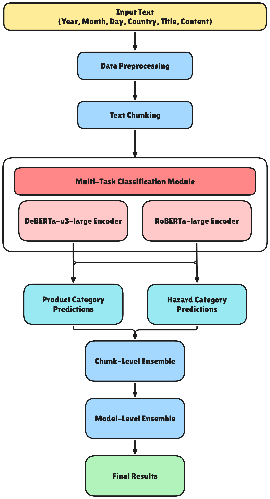

# Food Hazard Detection with Multi-task Learning and Focal Loss

## Overview

This repository presents a system for food hazard detection from web-based reports, developed for SemEval-2025 Task 9. The task involves jointly predicting hazard-category and product-category from food safety recall texts collected from public web sources worldwide.

## Table of Contents

1. [Problem Definition](#problem-definition)
2. [Dataset](#dataset)
3. [System Architecture](#system-architecture)
4. [Installation](#installation)
5. [Usage](#usage)
6. [Results](#results)
7. [Implementation Notes](#implementation-notes)
8. [Future Work](#future-work)
9. [References](#references)
10. [Authors](#authors)

---

## Problem Definition

Given food safety recall texts from various web sources, the system predicts two types of labels simultaneously:

- **Hazard-category**: The type of hazard present in the food product (10 classes, e.g., allergens, biological, foreign bodies)
- **Product-category**: The category of the affected food product (22 classes, e.g., cocoa and cocoa preparations, meat and meat products)

The hierarchical structure includes both main categories and detailed sub-task labels as illustrated below:


The dataset exhibits severe class imbalance with long-tail distributions (128x imbalance for hazard labels, 1,142x for product labels).

---

## Dataset

The dataset is provided by SemEval-2025 Task 9 and consists of:

- **Total samples**: 5,984 food safety recall reports
- **Sources**: Food safety authorities worldwide
- **Languages**: Multilingual (primarily English and German)
- **Features**: Year, Month, Day, Country, Title, Content
- **Label distribution**: Highly imbalanced with long-tail characteristics

The data is located in the `data/` directory:
- `data/train_data/original/train_original.csv`: Original training data
- `data/train_data/aug1/`: Augmented training data
- `data/incidents_valid.csv`: Validation set
- `data/incidents_test.csv`: Test set
- `data/ground_truth.csv`: Ground truth labels for evaluation

---

## System Architecture

The system employs a multi-task learning framework with the following components:



### Key Components

1. **Data Preprocessing**
   - HTML tag cleaning
   - Boilerplate text removal
   - Sentence-level deduplication
   - Domain-specific entity normalization

2. **Text Chunking**
   - Token-level chunking with overlap
   - Handles long documents exceeding Transformer input limits
   - Implemented with DeBERTa-specific tokenizer (512 tokens per chunk)

3. **Multi-Task Classification Module**
   - Two parallel Transformer encoders: DeBERTa-v3-large and RoBERTa-large
   - Joint prediction of hazard-category and product-category
   - Leverages semantic correlation between tasks

4. **Loss Function**
   - Focal Loss to address severe class imbalance
   - Focuses learning on hard-to-classify samples
   - Reduces impact of easy negative samples

5. **Two-Level Ensemble Strategy**
   - Chunk-level aggregation using mean pooling
   - Model-level soft voting between RoBERTa and DeBERTa predictions

### Example Classifications


---

## Installation

### Prerequisites

- Python 3.8 or higher
- CUDA-compatible GPU (recommended for training)
- pip package manager

### Step 1: Clone the Repository

```bash
git clone <https://github.com/chisngooo/FoodHazarDectection-DS310-FinalProject>
cd FoodHazarDectection-DS310-FinalProject
```

### Step 2: Install Dependencies

```bash
pip install -r requirements.txt
```

Required packages include:
- transformers
- torch
- pandas
- numpy
- scikit-learn
- jupyter

---

## Usage

### Step 1: Data Preprocessing

Preprocess the raw data to clean and normalize text:

```python
python utils/preprocessing.py
```

This script performs:
- HTML cleaning
- Boilerplate removal
- Sentence deduplication
- Text normalization

### Step 2: Data Augmentation (Optional)

Generate augmented training data for rare and confused classes:

```python
python utils/augument_data.py
```

This creates augmented samples in `data/train_data/aug1/` directory.

### Step 3: Text Chunking

Prepare chunked data for model training:

```python
python utils/chunk_data.py
```

This generates `chunked_deberta_512.json` with token-level chunks.

### Step 4: Model Training

#### Train RoBERTa Model

Open and execute `roberta-finetune.ipynb`:

```bash
jupyter notebook roberta-finetune.ipynb
```

Run all cells to:
- Load preprocessed data
- Configure model hyperparameters
- Train RoBERTa-large with multi-task learning
- Save trained model checkpoints

#### Train DeBERTa Model

Open and execute `deberta-finetune.ipynb`:

```bash
jupyter notebook deberta-finetune.ipynb
```

Run all cells to:
- Load chunked data
- Configure model hyperparameters
- Train DeBERTa-v3-large with multi-task learning
- Save trained model checkpoints

### Step 5: Data Statistics and Visualization

Analyze training data distribution:

```bash
jupyter notebook statstics_train.ipynb
```

This notebook provides:
- Label distribution analysis
- Class imbalance statistics
- Data quality metrics

### Step 6: Inference and Ensemble

Generate predictions and ensemble results:

```bash
jupyter notebook score_and_infer.ipynb
```

This notebook:
- Loads trained RoBERTa and DeBERTa models
- Performs chunk-level inference
- Aggregates chunk predictions
- Applies model-level ensemble with optimal weights
- Generates final predictions on test set
- Calculates Macro-F1 scores

### Step 7: Result Visualization

Visualize model performance:

```python
# Visualize single model comparison
python utils/visualize_single_comparison.py

# Visualize top 5 performance increases
python utils/visualize_top5_increase.py
```

---

## Results

### Performance Metrics

Evaluation metric: Macro-F1 (official SemEval-2025 Task 9 metric)

| Model / System | Macro-F1 |
|---|---|
| RoBERTa-large (single model) | 0.8027 |
| DeBERTa-v3-large (single model) | 0.7349 |
| Ensemble (optimal weights) | 0.8042 |

### Key Findings

- Best result: 0.8042 Macro-F1 using TITLE + TEXT concatenation
- Competitive ranking: Top 3-5 performance range in SemEval-2025 Task 9
- RoBERTa demonstrates strong multilingual generalization
- DeBERTa provides complementary gains in ensemble configuration
- Text input combination (TITLE + TEXT) outperforms individual inputs

---

## Implementation Notes

### Ensemble Weight Selection

Grid search on the public test set produces unstable weights and degraded performance (0.7842 Macro-F1). Selecting ensemble weights based on validation set performance yields more reliable and generalizable results (0.8042 Macro-F1).

### Focal Loss Configuration

Focal loss parameters are tuned to handle severe class imbalance:
- Alpha parameter: Class-frequency based weighting
- Gamma parameter: Focus on hard samples (gamma = 2.0)

### Multi-Task Learning Benefits

Joint modeling of hazard-category and product-category leverages semantic correlation between tasks, improving performance on both tasks compared to single-task models.

---

## Future Work

1. **Temporal and Geographical Features**: Incorporate date and location metadata as additional model inputs
2. **Specialized Multilingual Encoders**: Explore domain-adapted multilingual models for food safety text
3. **External Knowledge Integration**: Leverage food safety ontologies and domain knowledge bases
4. **Advanced Ensemble Techniques**: Investigate stacking and meta-learning approaches
5. **Active Learning**: Implement active learning for efficient annotation of edge cases

---

## References

- SemEval-2025 Task 9: Food Hazard Detection
- Liu, Y., et al. (2019). RoBERTa: A Robustly Optimized BERT Pretraining Approach
- He, P., et al. (2020). DeBERTa: Decoding-enhanced BERT with Disentangled Attention
- Lin, T. Y., et al. (2017). Focal Loss for Dense Object Detection
- Caruana, R. (1997). Multitask Learning

---

## Authors

**Ngô Minh Trí**  
**Nguyễn Đình Khôi**

University of Information Technology (UIT)  
Year: 2025

---

## License

See LICENSE file for details.
